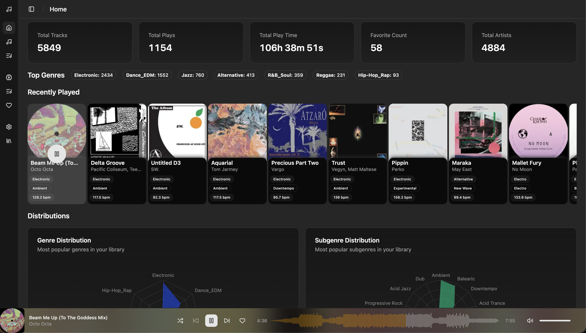
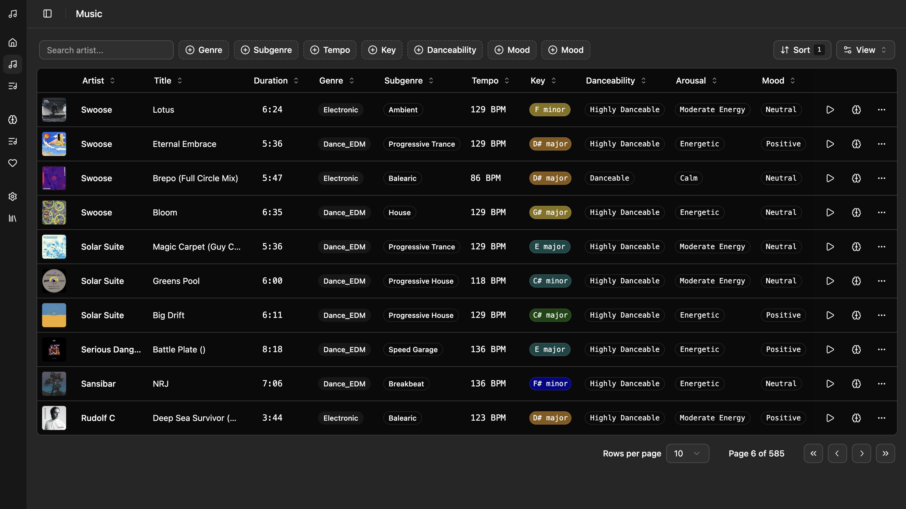
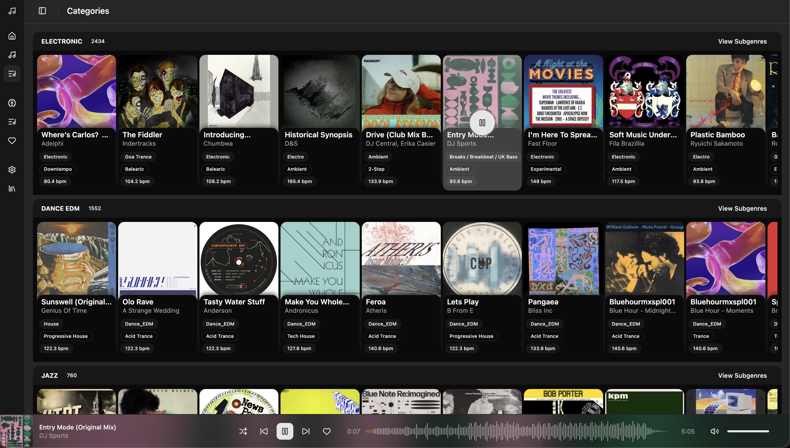
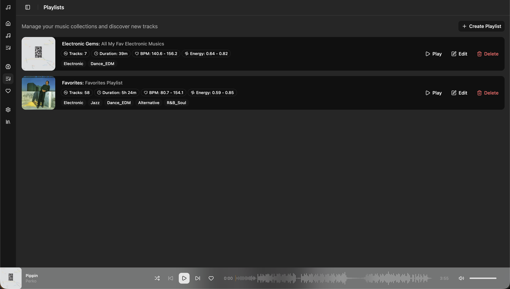
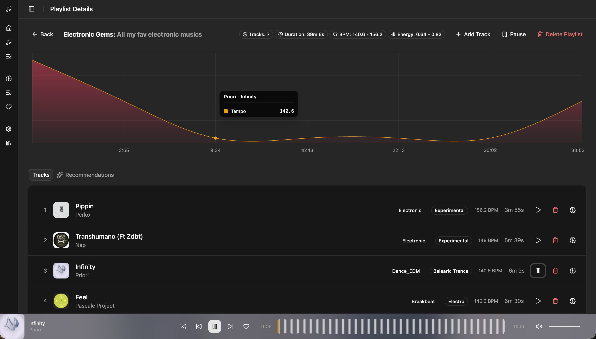
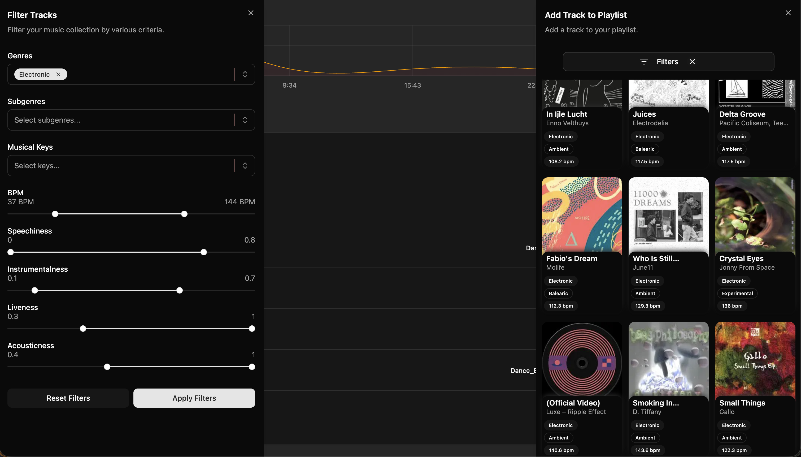
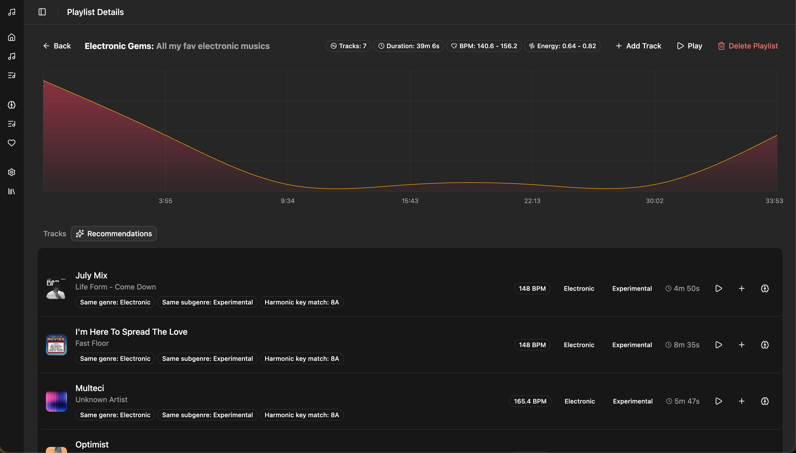
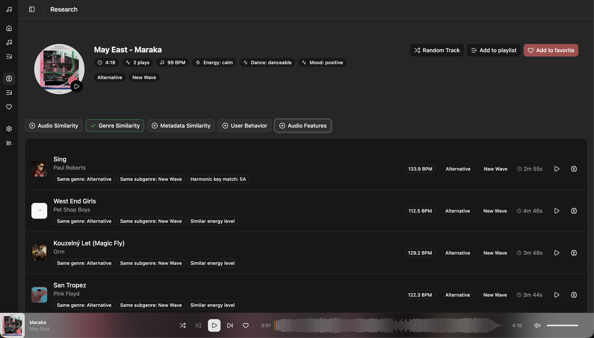

# 🎵 Muzo

**AI-powered music library organization for DJs and audiophiles**

Muzo is an intelligent personal assistant for music collections that uses audio fingerprinting and machine learning to automatically analyze, classify, and organize your music library. Transform chaotic collections with missing or incorrect tags into perfectly organized libraries without tedious manual work.



## ✨ Features

### 🎯 AI-Powered Analysis

- **Genre & Subgenre Classification** — CNN-based hierarchical classification with 82%+ accuracy
- **BPM Detection** — Adaptive FFT-based tempo detection
- **Key Detection** — Musical key and Camelot wheel notation
- **Mood & Energy Analysis** — Valence, arousal, danceability scoring
- **Audio Fingerprinting** — MFCC, spectral, rhythm, and melodic features

### 🎼 Music Collection



- **Rich Data Table** — View all tracks with artist, title, genre, subgenre, tempo, key, danceability, arousal, and mood
- **Advanced Filtering** — Filter by any attribute with multi-select dropdowns and range sliders
- **Sortable Columns** — Sort by any column to find exactly what you need
- **Pagination** — Handle large libraries with ease

### 📚 Library Management

- **Smart Scanning** — Full and incremental library scans with progress tracking
- **Advanced Filtering** — Filter by genre, BPM, key, mood, danceability, and more
- **Categories View** — Browse music organized by AI-detected genres



### 🎧 Playlist Management

- **Create & Organize** — Build playlists with drag-and-drop reordering
- **AI Recommendations** — Get smart track suggestions based on playlist analysis
- **Tempo Flow Visualization** — See BPM progression across your playlist





### 🔍 Music Discovery

- **Smart Recommendations** — Elasticsearch-powered similar track suggestions
- **Harmonic Mixing** — Find tracks with compatible keys
- **Similarity Finder** — Discover tracks by audio, genre, metadata, or user behavior







### 🎵 Music Player

- **Full Playback Controls** — Play, pause, seek, volume
- **Waveform Visualization** — Real-time audio visualization
- **Listening Statistics** — Track play counts and history

## 🏗️ Architecture

```
┌─────────────────────────────────────────────────────────────────┐
│                     Frontend (React 19)                         │
│  TanStack Router • TanStack Query • Tailwind • Shadcn/ui       │
└─────────────────────────────────────────────────────────────────┘
                              │
                              ▼
┌─────────────────────────────────────────────────────────────────┐
│                   Backend (NestJS 11)                           │
│  GraphQL (Apollo) • Prisma • BullMQ • Socket.IO                │
└─────────────────────────────────────────────────────────────────┘
          │                   │                    │
          ▼                   ▼                    ▼
┌──────────────┐    ┌──────────────┐    ┌──────────────────────┐
│   SQLite     │    │    Redis     │    │   Elasticsearch      │
│   (Prisma)   │    │   (Queues)   │    │   (Recommendations)  │
└──────────────┘    └──────────────┘    └──────────────────────┘
                              │
                              ▼
┌─────────────────────────────────────────────────────────────────┐
│                   AI Service (Python/Flask)                     │
│  librosa • PyTorch • audioflux • MusicBrainz • Discogs         │
└─────────────────────────────────────────────────────────────────┘
```

## 🚀 Quick Start

### Prerequisites

- Node.js 18+
- Python 3.10+
- Docker (for Redis)
- FFmpeg

### Installation

```bash
# Clone the repository
git clone https://github.com/yourusername/muzo.git
cd muzo

# Backend setup
cd backend
npm install
cp env.template .env
npm run redis:up
npm run prisma:generate
npm run prisma:migrate
npm run start:dev

# Frontend setup (new terminal)
cd frontend
npm install
npm run dev

# AI Service setup (new terminal)
cd ai-service
python -m venv .venv
source .venv/bin/activate
pip install -r requirements.txt
python run_services.py --port=4000
```

### Access Points

| Service             | URL                           |
| ------------------- | ----------------------------- |
| Frontend            | http://localhost:3000         |
| Backend GraphQL     | http://localhost:3000/graphql |
| Bull Board (Queues) | http://localhost:3001         |
| AI Service          | http://localhost:4000         |

## 📦 Project Structure

```
muzo/
├── frontend/          # React 19 + Vite + TanStack
├── backend/           # NestJS + GraphQL + Prisma
├── ai-service/        # Python Flask AI analysis
├── model-trainer/     # ML model training scripts
├── docs/              # Documentation & screenshots
└── specs/             # Feature specifications
```

## 🛠️ Tech Stack

| Layer           | Technologies                                                                    |
| --------------- | ------------------------------------------------------------------------------- |
| **Frontend**    | React 19, Vite, TanStack Router/Query, Tailwind CSS, Shadcn/ui, Recharts, p5.js |
| **Backend**     | NestJS 11, GraphQL (Apollo), Prisma, BullMQ, Socket.IO, Elasticsearch           |
| **AI Service**  | Python, Flask, librosa, PyTorch, audioflux, MusicBrainz, Discogs                |
| **Database**    | SQLite (Prisma), Redis                                                          |
| **ML Training** | PyTorch, scikit-learn, librosa                                                  |

## 📋 Roadmap & TODOs

### 🚧 Planned Features

#### Voice Control & AI Speech Integration

- [ ] Voice commands for music control ("next", "skip", "like")
- [ ] Natural language requests ("play something jazzy", "find tracks like this")
- [ ] AI-powered playlist generation via voice
- [ ] Multi-language support (French & English)

#### Cloud & Sync

- [ ] Turso database sync for multi-device support
- [ ] Cloud backup and restore
- [ ] Cross-device playback synchronization

### ✅ Completed

- [x] AI genre/subgenre classification
- [x] BPM, key, mood detection
- [x] Library scanning and management
- [x] Playlist creation and recommendations
- [x] Music similarity finder
- [x] Audio player with waveform visualization
- [x] Advanced filtering system

## 📖 Documentation

- [Frontend README](frontend/README.md)
- [Backend README](backend/README.md)
- [AI Service README](ai-service/README.md)
- [Model Trainer README](model-trainer/README.md)

## 📄 License

MIT License

## 👤 Author

**Alessandro Marelli**
